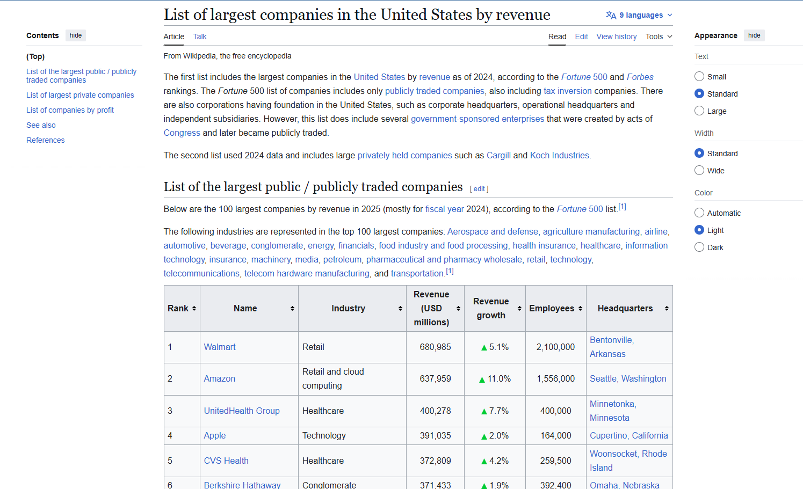
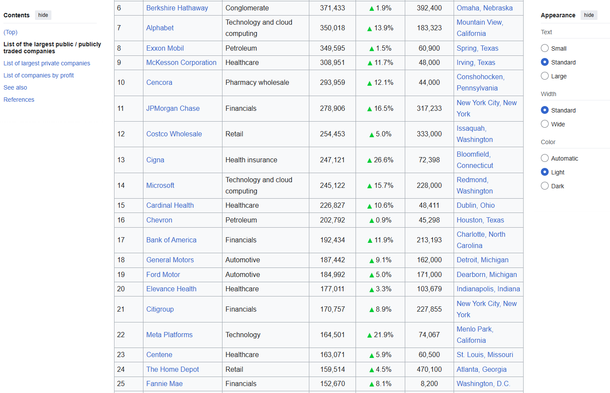

# Largest US Companies Web Scraping

## Project Overview

This project demonstrates a simple web scraping workflow using Python, Requests, BeautifulSoup and pandas.

The objective was to extract a structured table from a Wikipedia page containing the largest companies in the United States by revenue, transform the HTML table into a pandas DataFrame and export the final dataset as a CSV file.

## Tools Used

- Python
- Jupyter Notebook
- Requests
- BeautifulSoup
- pandas
- GitHub

## Data Source

The data was extracted from a publicly available Wikipedia page listing the largest companies in the United States by revenue.

This project was created for educational and portfolio purposes.

## Source Table Preview

The data was extracted from a public Wikipedia table listing the largest companies in the United States by revenue.

### Source Page




## Project Workflow

1. Sent an HTTP request to the target webpage using `requests`.
2. Parsed the HTML content using `BeautifulSoup`.
3. Located the target table in the HTML.
4. Extracted the table headers.
5. Extracted each table row.
6. Stored the extracted data in a pandas DataFrame.
7. Exported the final structured dataset to CSV.

## Extracted Fields

The final dataset includes the following columns:

- Rank
- Name
- Industry
- Revenue
- Revenue growth
- Employees
- Headquarters

## Repository Structure

```text
largest-us-companies-web-scraping/
│
├── README.md
├── LICENSE
├── requirements.txt
├── .gitignore
│
├── notebooks/
│   └── largest_us_companies_web_scraping.ipynb
│
├── data/
│   └── extracted/
│       └── largest_us_companies_by_revenue.csv
│
└── images/
    ├── source_table_preview1.png
    └── source_table_preview2.png
